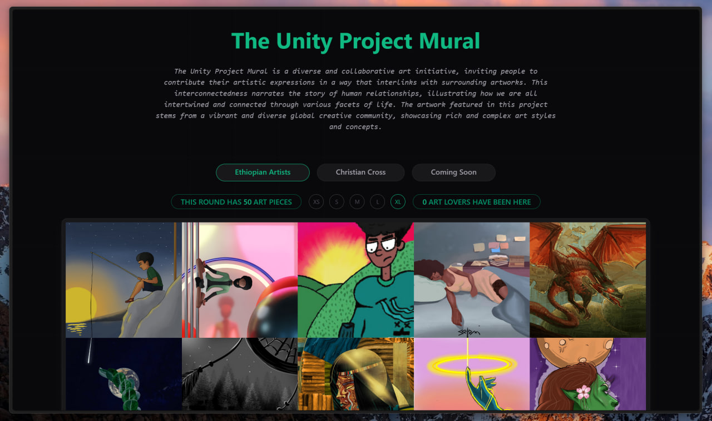

# [The Unity Project Mural](https://www.unitymural.art)

The Unity Project Mural is the biggest and most diverse collaborative digital art mural in the world inviting people to contribute their artistic expressions in a way that interlinks with surrounding artworks. This interconnectedness narrates the story of human relationships, illustrating how we are all intertwined and connected through various facets of life.

- A collaborative art initiative
- Interconnected artworks
- A story of human relationships
- A showcase of diverse art styles and concepts

## Murals

The first mural launched in 2023, showcased 50 gorgeous art pieces from some of the best and well known Ethiopian digital artists. The second mural, named the Christian Cross, was running in 2024 with 22 breathtaking spiritual art pieces. With slots still open for you to contribute to. The mural for 2025 is now coming soon with a brand new canvas to showcase 25 of your epic collaborative art pieces. Join [our group](https://t.me/TheUnityProjectMuralGroup) to get notified when the theme drops.

## How to Reserve a Spot

1.  Join the Telegram group: <https://t.me/TheUnityProjectMuralGroup>
2.  Choose a spot
3.  Reserve the spot by texting the group in the following format: John Doe @InstagramUsername Spot:12 Time:1 Day
4.  Create your art piece
5.  Send the uncompressed high-quality file to the group

## Art Piece Guidelines

- The dimension for your drawing should be any square with a minimum of 500x500 pixels.
- Draw your art piece in a way it connects to the arts beside the spot you chose while also drawing in a way that lets others continue off from your drawing on all sides.
- When you finish drawing, send the uncompressed high-quality file in the group.

## All these art pieces but you're the one who belongs in a museum
